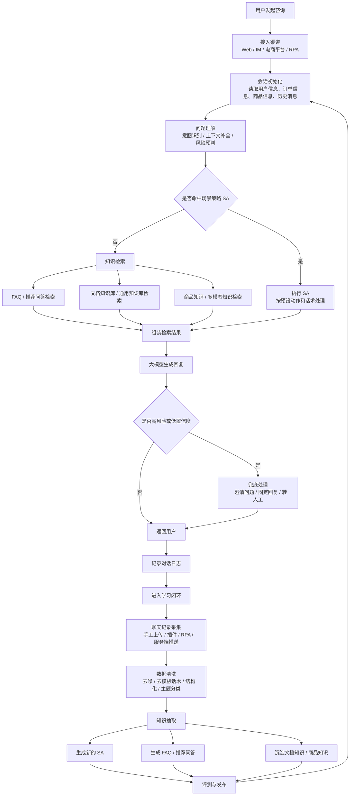
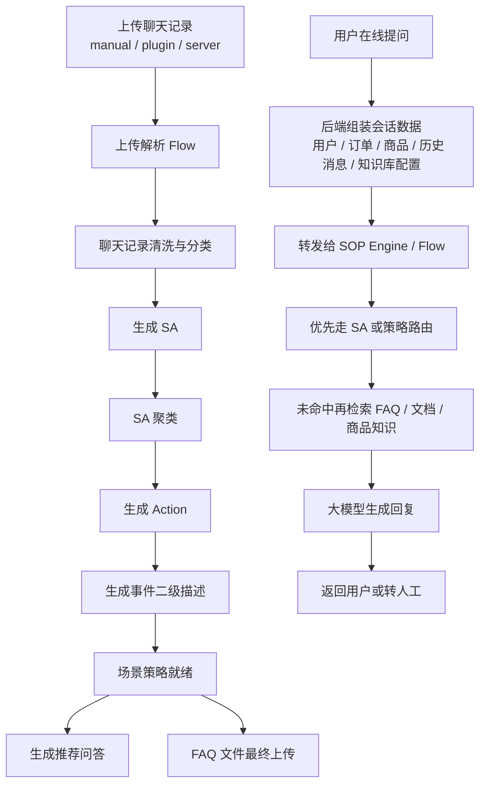

 AI客服项目流程：

1. 采集数据：系统会拿到聊天记录，来源可以是人工上传，RPA同步过来的，或者是浏览器插件，服务端同步过来的
2. 数据清洗：原始聊天记录有很多噪音，如果表情、系统提示欢迎语、无效重复内容，系统把这些内容过滤掉，再把真正有业务价值的对话保留。并按照主题分类，比如物流、售后、退款、产品咨询等
3. 经验抽取：清洗的后对话进行提炼成结构化资产，主要有三类：

+ SA ： 场景策略。用户在什么场景提了什么问题，客服应该怎样处理“抽出来”
+ FAQ/问答知识库： 高频、稳定、可复用的问题答案沉淀下来
+ 文档知识库：商品知识、文档知识、业务说明供后续检索

4. 去重和归并：系统会对SA做聚类、合并，对问答做去重，避免知识库越来越乱

5. 发布到线上能力：整理好的SA、FAQ、知识库会挂到客服机器人的运行环境里，之后用户再来问相似问题，系统就不需要从零思考，而是优先复用这些能力

6. 持续循环：新的聊天记录会不断进入系统，系统持续清洗、提取、更新这些知识资产，这就是“自学习”。

   数据表里面存的类似是这种

   | id   | event_first_label | event_second_label | situation                                                | action                                                       | transfer_to_human |
   | :--- | :---------------- | :----------------- | :------------------------------------------------------- | :----------------------------------------------------------- | :---------------- |
   | 1    | 物流问题          | 催发货             | 用户下单后长时间未见发货，询问什么时候可以发出           | 查询订单状态；若未发货，告知预计发货时间；若因活动高峰或库存原因延迟，说明原因并安抚用户；超出承诺时效时提示可升级处理 | 否                |
   | 2    | 物流问题          | 查询物流           | 用户表示包裹物流信息长时间未更新，想知道商品目前到哪里了 | 查询物流单号和最新轨迹；同步最新物流节点；若物流停滞时间过长，说明可能原因并协助催件；异常件时提示售后处理 | 否                |
   | 3    | 售后问题          | 修改收货地址       | 用户下单后发现地址填写错误，希望在发货前修改地址         | 核实订单是否已发货；未发货则收集新地址并协助修改；已发货则说明通常无法直接修改，并建议联系物流或按平台规则处理 | 否                |
   | 4    | 售后问题          | 商品破损           | 用户收到商品后发现包装或商品本体有破损，要求处理         | 先致歉；引导用户提供破损图片、订单信息和问题描述；核实后按规则提供补发、换货、退款或补偿方案 | 是                |
   | 5    | 退款退货          | 申请退款           | 用户下单后不想要了，希望直接退款                         | 确认订单状态；未发货则引导直接退款或协助拦截；已发货则说明需按平台规则走退货退款流程，并同步退款时效 | 否                |
   | 6    | 商品咨询          | 尺码推荐           | 用户咨询自己的身高体重适合穿哪个尺码                     | 收集身高、体重和穿着偏好；结合尺码表推荐合适尺码；若在两个尺码间犹豫，则说明差异并给出建议 | 否                |
   | 7    | 商品咨询          | 商品材质           | 用户询问商品是什么材质，是否适合自己的需求               | 从商品知识中检索材质、成分和适用场景；用简洁语言回答；如用户继续追问厚薄、透气性、柔软度，则补充说明 | 否                |
   | 8    | 价格促销          | 优惠活动           | 用户询问当前商品有没有优惠券、满减或活动价               | 查询当前可用优惠信息；明确告知优惠券、满减、赠品和到手价；若活动有时间限制，提醒活动截止时间 | 否                |

   
